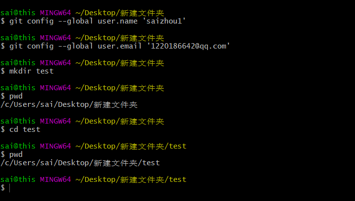

#github及git学习
* *设置用户名*
git config --global user.name 'saizhou1'
* *设置用户名邮箱*
git config --global user.email '1220186642@qq.com'
##linux 命令
|命令|解释|
|----|----|
| touch | 创建文件|
|rm     |删除文件 |
|cd|更改目录|
|pwd|打印工作目录|
|mkdir(make directory)|创建文件夹|
|ls |命令显示当前目录的内容|
###提示
当你输入LS时，它会把你当前目录下的文件罗列出来
vi myfile 之后点击i进入type模式，退出先按ESC（ Escape）再输入wq（保存并退出）
vi编辑器是所有Unix及Linux系统下标准的编辑器，它的强大不逊色于任何最新的文本编辑器
###git上传文件
* cat （concatenate）命令用于连接文件并打印到标准输出设备上。
* rm -rf a1.php删除工作区文件
* git rm a1.php删除暂存区文件
* git commit -m '第一次通过git删除仓库文件'  提交git仓库陈述。

##git 命令
* 初始化一个新git仓库
#####创建文件夹
mkdir test
#####在文件夹内初始化git（创建git仓库）
cd test
git init
#####创建文件
touch a1.php
#####把文件从工作区添加到暂存区
git add a1.php
#####将文件从暂存区提交到仓库
git commit -m '提交描述'
#####删除文件
rm -rf a1.php
#####从Git中删除文件
git rm a1.php
#####提交操作
git commit -m '提交描述'
git push   提交到github账户

|命令|解释|
|----|----|
|git config --list| 查看配置，如用户名和邮箱|
|git add|把文件从工作区提交到暂存区|
|git status|查看状态|
|git commit -m '提交描述'|
|git clone 仓库地址  | 下载github文件克隆到本地|
##个人网站访问
http://用户名.github.io
##搭建网站
*创建个人网站-》新建仓库仓库名必须是（用户名.github.io）
*在仓库下新建index.html文件即可
##注意：
github pages只支持静态网页
仓库这里面只能是.html文件

project pages项目站点
##快捷键
快捷键t搜索文件